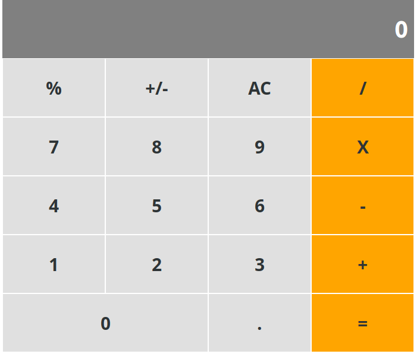

# calculator
A simple calculator application created using react framework.
[Live Link.](https://calculator-inc-app.herokuapp.com)

## Technologies
- Javascript
- React Framework
- Webpack
- Babel

## Instruction
- git clone repository. run  `git clone https://github.com/Urchmaney/calculator.git`
- run `cd calculator`
- run  `npm start`

## Authors
👤 **Kingsley Uche**

- Github: [@urchmaney](https://github.com/Urchmaney)
- Linkedin: [@urchmaney](https://www.linkedin.com/in/kingsley-uche/)
- Twitter: [@urchmaney](https://twitter.com/kingsleyunegbu)
